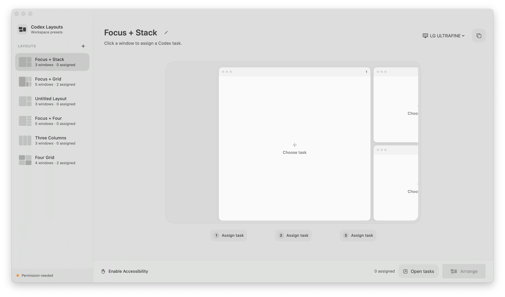

# Codex Layouts

A small, native macOS workspace arranger for people who work across several
Codex tasks at once.



Codex Layouts lets you choose a visual window layout, assign a recent local
Codex task to each pane, select a display, and arrange the matching open Codex
windows. It is intentionally local-first and dependency-free.

> [!IMPORTANT]
> This is an independent community project. It is not affiliated with,
> endorsed by, or sponsored by OpenAI.

## What works today

- Five polished starter layouts, including a large focus pane with two or four
  supporting panes.
- Saved local layouts and task assignments.
- A searchable picker backed by the local Codex task index.
- Multi-display selection, with LG displays preferred on first launch.
- Accessibility-based positioning of matching open Codex windows.
- A global `Control–Option–L` shortcut, menu bar access, and regular app launch.
- Light/Dark mode, reduced-motion support, and desktop-sized hit targets.
- A one-command local build/run loop and a Codex Run action.

## Current limitation

The app can only arrange a task after that task has its own open Codex window.
It matches windows by their visible task title. **Open tasks** uses Codex deep
links, but Codex may reuse an existing window instead of creating a new one.
Automatic creation and durable task-to-window identity are tracked for a later
milestone.

## Requirements

- macOS 15 or newer
- Xcode 26 or a compatible Swift 6 toolchain
- Codex for macOS
- Accessibility permission for arranging windows

No account, server, analytics SDK, package dependency, or network connection is
used by Codex Layouts.

## Build and run

```sh
git clone https://github.com/RammonZub/codex-layouts.git
cd codex-layouts
./script/build_and_run.sh
```

The script builds the Swift package, stages `dist/Codex Layouts.app`, applies a
local ad-hoc signature, and opens the bundle. It also supports:

```sh
./script/build_and_run.sh --verify
./script/build_and_run.sh --debug
./script/build_and_run.sh --logs
```

You can also open `Package.swift` directly in Xcode.

## How it works

1. Layouts are normalized rectangles, independent of any particular display
   size.
2. Recent task metadata is read from `~/.codex/state_5.sqlite` using SQLite's
   read-only mode.
3. The selected display's visible frame excludes the menu bar and Dock.
4. macOS Accessibility APIs read Codex window titles and set position/size.
5. Layouts and assignments are stored as versionable JSON in Application
   Support.

See [Architecture](docs/ARCHITECTURE.md), [Design system](docs/DESIGN.md), and
[Roadmap](docs/ROADMAP.md) for the decisions behind the implementation.

## Privacy and permissions

Codex Layouts runs entirely on your Mac. It reads only the task ID, title,
project path, and last-updated time needed for the picker. It never writes to
the Codex database. Accessibility is used only after you choose **Arrange**.
Read the full [privacy note](PRIVACY.md).

## Contributing

Issues and focused pull requests are welcome. Start with
[CONTRIBUTING.md](CONTRIBUTING.md) and the
[Code of Conduct](CODE_OF_CONDUCT.md). Security-sensitive reports should follow
[SECURITY.md](SECURITY.md).

## License

GNU General Public License v3.0 or later. See [LICENSE](LICENSE).
