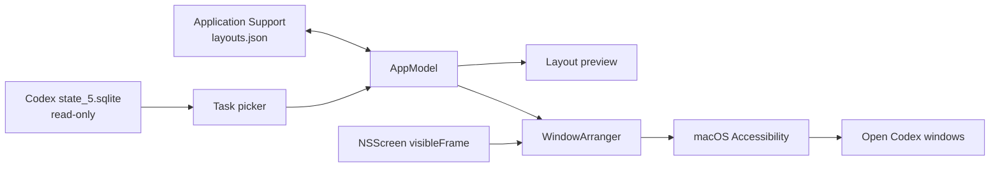

# Architecture

Codex Layouts is a native Swift 6 macOS application built as a Swift package.
The package has no third-party runtime dependencies and can be opened directly
in Xcode.

## Boundaries

- `App/` owns scenes, app lifecycle, commands, and activation.
- `Views/` owns SwiftUI composition and view-local interaction state.
- `Models/` contains Codable value types and normalized geometry.
- `Stores/` owns app state and local JSON persistence.
- `Services/` is the narrow platform boundary for SQLite, Accessibility,
  deep links, and the global hotkey.
- `Support/` contains reusable visual and activation glue.

SwiftUI is the source of truth. AppKit is limited to the frosted backdrop,
workspace activation, and display metadata. ApplicationServices is isolated in
the window arranger and permission helper.

## Data flow

## Privacy invariants

- The Codex SQLite database is opened with `SQLITE_OPEN_READONLY`.
- Queries are bounded to 250 rows.
- The app has no networking code.
- Layout persistence contains task IDs and layout metadata, not messages.
- Accessibility access is not requested until the user asks for it.

## Coordinate systems

Layouts use a top-left normalized coordinate space (`0...1`) because that
matches how people sketch panes. SwiftUI previews use the same space. The
solver converts into AppKit's bottom-left screen coordinates, then the
Accessibility edge converts positions to the global top-left coordinate space.

Display frames always come from `NSScreen.visibleFrame`, so the menu bar and
Dock are respected and no monitor resolution is hard-coded.

## Known compatibility seam

Codex does not currently expose a stable public API that maps a task ID to a
specific native window. The first release therefore matches open windows by
their visible task title. This implementation is isolated inside
`WindowArranger` so a future official window identity API can replace it
without changing the layout model or UI.
